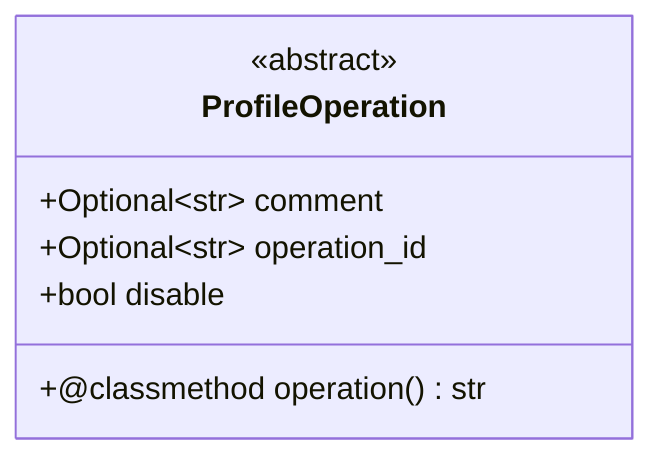
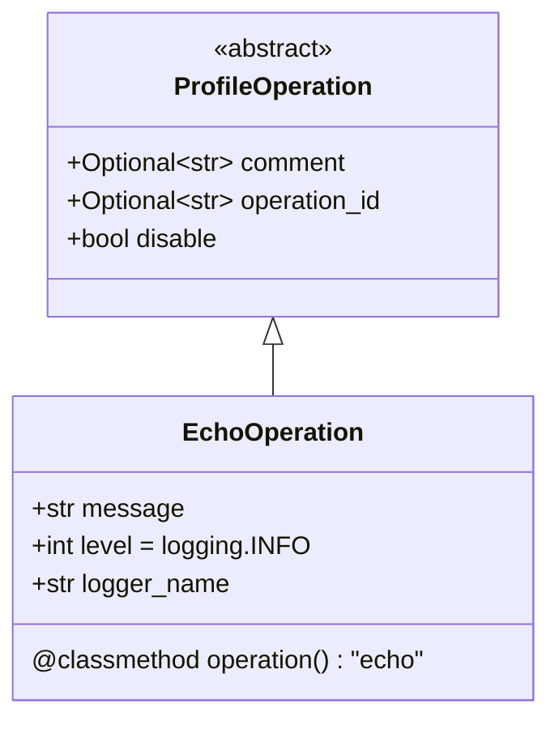
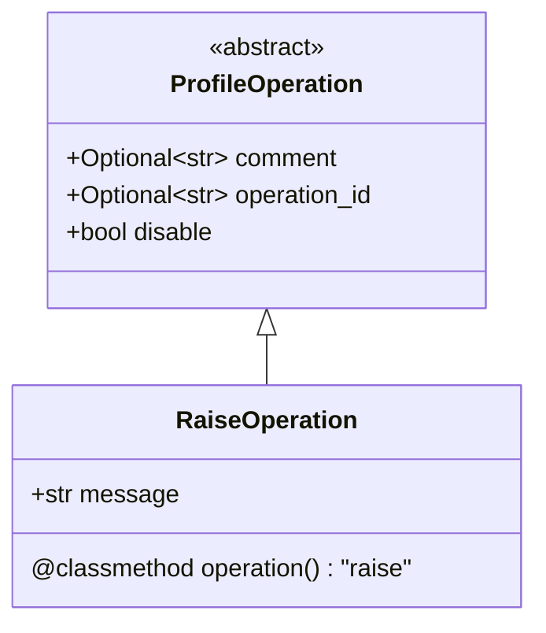
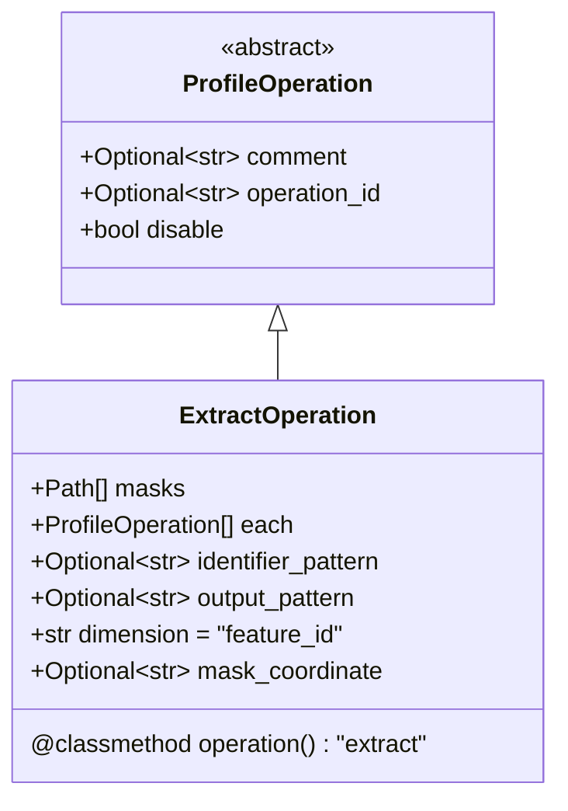
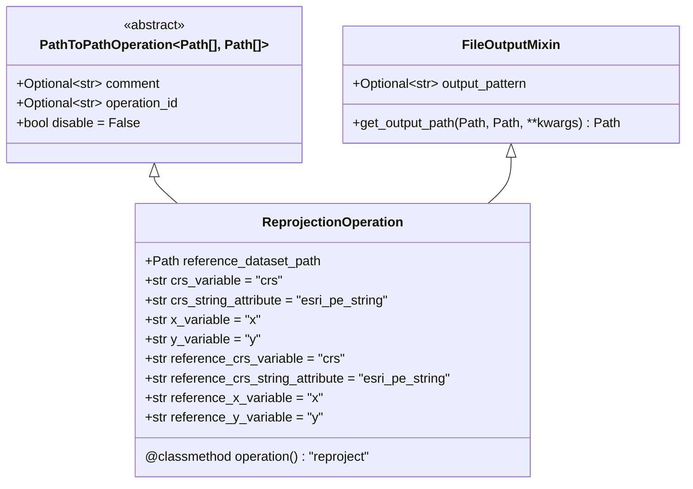

# National Water Model Post Processing

---

## Profiles

Logic is driven via Profile files in order to select operations and add/remove functionality and products without 
altering the source code.

By default, these profiles are found under `$APP_PATH/resources/profiles`.

---

## Required Elements

Profiles require two major elements: top level identifiers and operations.

### Top Level Identifiers

The application identifies what profiles to use based on key identifiers encoded into National Water Model file names.

> **Context**
> 
> The high performance computing environments that the National Water Model is run on have a requirement that this
> metadata is encoded into the file name - it's a requirement out of control of side projects and a reliable feature.

File names _must_ follow the pattern of: 

    <model abbreviation>.t<cycle>z.<configuration>.<output_type><member?>.<frame>.<region>.nc

Examples are:

- nwm.t00z.short_range.channel_rt.f001.conus.nc
- nwm.t06z.medium_range.channel_rt_4.f006.conus.nc
- gdaswave.t18z.atlocn.0p16.f008.grib2
- blend.t02z.core.f003.ak.grib2

Using this we can construct the following Python-flavored regular expression to identify and extract the required metadata:

```regexp
nwm\.t(?P<cycle>\d+)z\.(?P<configuration>[A-Za-z_]+)\.(?P<output_type>[a-zA-Z_]+)(_(?P<member>\d+))?\.(?P<frame>(tm|f)\d+)\.(?P<region>[A-Za-z_]+(\.[a-z]{2}rfc)?)\.nc
```

It looks scary, but it lets you extract the exact values via:

```python
import re
pattern: re.Pattern = re.compile(
    r"nwm\."
    r"t(?P<cycle>\d+)z\."
    r"(?P<configuration>[A-Za-z_]+)\."
    r"(?P<output_type>[a-zA-Z_]+)(_(?P<member>\d+))?\."
    r"(?P<frame>(tm|f)\d+)\."
    r"(?P<region>[A-Za-z_]+(\.[a-z]{2}rfc)?)\."
    r"nc"
)

name: str = "nwm.t00z.short_range.land.f002.conus.nc"
match: re.Match = pattern.search(name)

from pprint import pprint
pprint(match.groupdict())
```

```
{
    "cycle": "00",
    "configuration": "short_range",
    "output_type": "land",
    "member": None,
    "frame": "f002",
    "region": "conus"
}
```

Each Profile has these descriptors on the top level, specifically `"configuration"`, `"output_type"`, `"member"`, and 
`"region"`. `"cycle"` and `"frame"` aren't necessary as `"cycle"` doesn't impact the logic and each set of model 
outputs consists of multiple frames.

The application finds profiles to run by loading in all the profiles and extracting those whose identifiers match.

> **"configuration"**
> 
> "configuration" values come from [post_processing.enums.Configuration](post_processing/enums.py) and encompass 
> values like 'short_range' and 'analysis_assim_extend'. These may be referenced for templating via the name `Configuration`

> **"output_type"**
> 
> "output_type" values come from [post_processing.enums.ModelOutputType](post_processing/enums.py) and encompass 
> values like 'channel_rt', 'land', and 'forcing'. These may be referenced for templating via the name `ModelOutputType`

> **"region"**
> 
> "region" values come from [post_processing.enums.Region](post_processing/enums.py) and encompass values like 'conus' 
> or 'alaska' or 'wgrfc'. These may be referenced for templating via the name `Region`

### Operations

These are the meat and potatoes of Profiles and all post-processing operations as they declare what all is to be done.

From the following example:

```json
{
    "operations": [
        {
            "operation": "drop",
            "exclude": true,
            "fields": ["feature_id", "time", "reference_time", "streamflow", "crs"]
        },
        {
            "operation": "on_each",
            "comment": "Add upstreamflow to each input file by calling 'post_processing.transform.calculate_upstream_flow.calculate_upstream_flow' on each",
            "on_each": [
                {
                    "operation": "function",
                    "function_name": "post_processing.transform.calculate_upstream_flow.calculate_upstream_flow",
                    "comment": "This should end up calling `calculate_upstream_flow(input_path=data, output_path=data, routelink_path='{application_path}/RouteLink_CONUS.nc')`",
                    "kwargs": {
                        "routelink_path": "{routelink_path}/RouteLink_AK.nc",
                        "routelink_from_variable": "from",
                        "output_path": "{work_directory}/upstream.{input_name}"
                    },
                    "argument_mapping": {
                        "input_path": "data"
                    }
                }
            ]
        }
    ],
    "configuration": "analysis_assim",
    "output_type": "channel_rt",
    "region": "alaska",
    "member": null
}
```

There are exactly two top level operations that may be performed when the application encounters files where the 
configuration is "analysis_assim", the output type is "channel_rt", the region is "alaska", and member is `null`. 
The second has its own set of operations that it may call within its `"on_each"` collection.

The most important member variable of these operations is `"operation"`. This indicates what will be done. 
For instance, the first operation states `"operation": "drop"`. This means that the operation will drop a 
variable or dimension. The next has `"operation": "on_each"`, which means the operation will perform each contained 
operation completely seperately from the others. The one operation within the `on_each` operation has 
`"operation": "function"`, meaning that it will call a python functon on each input.

---

## Operation Types

---

### ProfileOperation



The base class for all Operations is the `ProfileOperation`. By default, all operations get an `operation_id`, 
which indicates when the operation is called. This is automatically generated. You can also insert a `comment`. 
This does not affect behavior, it just allows you to drop comments into the configurations where helpful. Lastly, 
there is `disable` which lets you disable an action. This is helpful for diagnostics and profile development. Each
`ProfileOperation` class has a class level `operation()` function that returns the type of operation for that class.
That value comes from the `OperationType` enum in [profile.py](post_processing/schema/profile.py).

### EchoOperation



The `EchoOperation`, dictated within the configuration by `"operation": "echo"`, just prints a message to the logs. 
This is useful for leaving helpful messages to make it easier to track what the application is doing. The message 
value may be formatted like classic Python template strings, like `"{variable_name}_{number:,}"`, where the 
`variable_name` and `number` values are available metadata values. Metadata values will generally come from attributes 
within the source netcdf values and elements of the profile itself.

Expect to see available variables like the following:

| Key                         | Value                                                                                                                                                             |
|----------------------------|-------------------------------------------------------------------------------------------------------------------------------------------------------------------|
| profile                    | Profile for short range executions for channel Routing data over CONUS                                                                                           |
| process_identifier         | 5939459439342952520                                                                                                                                                |
| work_directory             | /path/to/nwm-post-processing/intermediate/5939459439342952520                                                                               |
| previous_operations        | 1: Drop all data variables except feature_id, time, reference_time, streamflow, crs<br>2: Create anomaly categories:<br>p05.nc::streamflow_0_4(time) => -5.0<br>p10.nc::streamflow_5_9(time) => -3.0<br>p25.nc::streamflow_10_24(time) => -1.25<br>p75.nc::streamflow_50_75(time) => 0.0<br>p90.nc::streamflow_76_90(time) => 0.5<br>p95.nc::streamflow_91_95(time) => 1.5<br>Default category: 3<br>Save path format: anomaly.nwm.t{cycle}z.{Configuration}.{ModelOutputType}.{frame}.{region}.nc<br>3: Print "INFO => Calculated Anomaly, now calculating upstreamflow"<br>4.1: Call post_processing.transform.calculate_upstream_flow.calculate_upstream_flow(...)<br>4: Perform the following on each file:<br>5: Merge all input files<br>6.2.1: Print "INFO => Dropping 'streamflow' anomaly from: {input_name}"<br>6.2.2: Drop streamflow_anomaly<br>6.2.3: Print "INFO => dropped streamflow anomaly from '{input_name}', now extracting data by rfc" |
| TITLE                      | OUTPUT FROM NWM v3.0                                                                                                                                              |
| featureType                | timeSeries                                                                                                                                                        |
| proj4                      | +proj=lcc +units=m +a=6370000.0 +b=6370000.0 +lat_1=30.0 +lat_2=60.0 +lat_0=40.0 +lon_0=-97.0 +x_0=0 +y_0=0 +k_0=1.0 +nadgrids=@                                   |
| model_initialization_time  | 2025-07-31_06:00:00                                                                                                                                                |
| station_dimension          | feature_id                                                                                                                                                        |
| model_output_valid_time    | 2025-08-01_00:00:00                                                                                                                                                |
| model_total_valid_times    | 18                                                                                                                                                                |
| stream_order_output        | 1                                                                                                                                                                 |
| cdm_datatype               | Station                                                                                                                                                           |
| Conventions                | CF-1.6                                                                                                                                                            |
| code_version               | v5.3.0-alpha1                                                                                                                                                     |
| NWM_version_number         | v3.0                                                                                                                                                              |
| model_output_type          | channel_rt                                                                                                                                                        |
| model_configuration        | short_range                                                                                                                                                       |
| dev_OVRTSWCRT              | 1                                                                                                                                                                 |
| dev_NOAH_TIMESTEP          | 3600                                                                                                                                                              |
| dev_channel_only           | 0                                                                                                                                                                 |
| dev_channelBucket_only     | 0                                                                                                                                                                 |
| dev                        | dev_ prefix indicates development/internal meta data                                                                                                              |
| time.long_name             | valid output time                                                                                                                                                 |
| time.standard_name         | time                                                                                                                                                              |
| time.valid_min             | 29232420                                                                                                                                                          |
| time.valid_max             | 29233440                                                                                                                                                          |
| time__date                 | 20250801                                                                                                                                                          |
| time__hour                 | 0                                                                                                                                                                 |
| time__minute               | 0                                                                                                                                                                 |
| time__second               | 0                                                                                                                                                                 |
| time__day                  | 1                                                                                                                                                                 |
| time__month                | 8                                                                                                                                                                 |
| time__year                 | 2025                                                                                                                                                              |
| reference_time.long_name   | model initialization time                                                                                                                                         |
| reference_time.standard_name| forecast_reference_time                                                                                                                                          |
| reference_time__date       | 20250731                                                                                                                                                          |
| reference_time__hour       | 6                                                                                                                                                                 |
| reference_time__minute     | 0                                                                                                                                                                 |
| reference_time__second     | 0                                                                                                                                                                 |
| reference_time__day        | 31                                                                                                                                                                |
| reference_time__month      | 7                                                                                                                                                                 |
| reference_time__year       | 2025                                                                                                                                                              |
| feature_id.long_name       | Reach ID                                                                                                                                                          |
| feature_id.comment         | NHDPlusv2 ComIDs within CONUS, arbitrary Reach IDs outside of CONUS                                                                                               |
| feature_id.cf_role         | timeseries_id                                                                                                                                                     |
| crs.transform_name         | latitude longitude                                                                                                                                                |
| crs.grid_mapping_name      | latitude longitude                                                                                                                                                |
| crs.esri_pe_string         | GEOGCS["GCS_WGS_1984",...];...;IsHighPrecision                                                                                                                    |
| crs.spatial_ref            | GEOGCS["GCS_WGS_1984",...];...;IsHighPrecision                                                                                                                    |
| crs.long_name              | CRS definition                                                                                                                                                    |
| crs.longitude_of_prime_meridian | 0.0                                                                                                                                                        |
| crs._CoordinateAxes        | latitude longitude                                                                                                                                                |
| crs.semi_major_axis        | 6378137.0                                                                                                                                                         |
| crs.semi_minor_axis        | 6356752.5                                                                                                                                                         |
| crs.inverse_flattening     | 298.2572326660156                                                                                                                                                 |
| streamflow.long_name       | River Flow                                                                                                                                                        |
| streamflow.units           | m3 s-1                                                                                                                                                            |
| streamflow.grid_mapping    | crs                                                                                                                                                               |
| streamflow.valid_range     | [0, 5000000]                                                                                                                                                      |
| nudge.long_name            | Amount of stream flow alteration                                                                                                                                  |
| nudge.units                | m3 s-1                                                                                                                                                            |
| nudge.grid_mapping         | crs                                                                                                                                                               |
| nudge.valid_range          | [-5000000, 5000000]                                                                                                                                                |
| velocity.long_name         | River Velocity                                                                                                                                                    |
| velocity.units             | m s-1                                                                                                                                                             |
| velocity.grid_mapping      | crs                                                                                                                                                               |
| velocity.valid_range       | [0, 5000000]                                                                                                                                                      |
| qSfcLatRunoff.long_name    | Runoff from terrain routing                                                                                                                                       |
| qSfcLatRunoff.units        | m3 s-1                                                                                                                                                            |
| qSfcLatRunoff.grid_mapping | crs                                                                                                                                                               |
| qSfcLatRunoff.valid_range  | [0, 2000000000]                                                                                                                                                   |
| qBucket.long_name          | Flux from gw bucket                                                                                                                                               |
| qBucket.units              | m3 s-1                                                                                                                                                            |
| qBucket.grid_mapping       | crs                                                                                                                                                               |
| qBucket.valid_range        | [0, 2000000000]                                                                                                                                                   |
| qBtmVertRunoff.long_name   | Runoff from bottom of soil to bucket                                                                                                                              |
| qBtmVertRunoff.units       | m3                                                                                                                                                                |
| qBtmVertRunoff.grid_mapping| crs                                                                                                                                                               |
| qBtmVertRunoff.valid_range | [0, 20000000]                                                                                                                                                     |
| allow_threading            | False                                                                                                                                                             |
| application_path           | /path/to/nwm-post-processing                                                                                                                 |
| base_path                  | /path/to/nwm-post-processing                                                                                                                 |
| date_format                | %Y-%m-%d %H:%M:%S%z                                                                                                                                               |
| debug                      | True                                                                                                                                                              |
| default_netcdf_engine      | h5netcdf                                                                                                                                                          |
| intermediate_directory     | /path/to/nwm-post-processing/intermediate                                                                                                    |
| json_log_level             | 20                                                                                                                                                                |
| json_log_maximum_bytes     | 1048576                                                                                                                                                           |
| json_log_path              | None                                                                                                                                                              |
| lazy_load_netcdf           | False                                                                                                                                                             |
| log_format                 | [%(asctime)s] %(levelname)s %(name)s: %(message)s                                                                                                                 |
| log_level_override_path    | /path/to/nwm-post-processing/resources/log_level_override.json                                                                               |
| loggers_to_quiet           | []                                                                                                                                                                |
| logging_config_path        | /path/to/nwm-post-processing/resources/python_log_config.json                                                                               |
| mask_path                  | /path/to/nwm-post-processing/resources/masks                                                                                                 |
| maximum_additional_threads | 3                                                                                                                                                                 |
| netcdf_cache_size          | 3                                                                                                                                                                 |
| prefix                     | PP                                                                                                                                                                |
| profile_path               | /path/to/nwm-post-processing/resources/profiles                                                                                              |
| resource_path              | /path/to/nwm-post-processing/resources                                                                                                       |
| routelink_path             | /path/to/nwm-post-processing/resources/routelink                                                                                            |
| threshold_path             | /path/to/nwm-post-processing/resources/thresholds                                                                                           |
| verbosity                  | 1                                                                                                                                                                 |
| output_path                | scratch/test                                                                                                                                                      |
| ModelOutputType            | channel_rt                                                                                                                                                        |
| Region                     | conus                                                                                                                                                             |
| Configuration              | short_range                                                                                                                                                       |
| member                     | None                                                                                                                                                              |
| cycle                      | 06                                                                                                                                                                |
| stage                      | 6.2.4.1                                                                                                                                                           |
| file_name                  | nwm.t06z.short_range.channel_rt.abrfc                                                                                                                             |
| frame                      |                                                                                                                                                                   |
| RFC                        | None                                                                                                                                                              |
| input_name                 | nwm.t06z.short_range.channel_rt.abrfc.nc                                                                                                                          |
| input_path                 | /path/to/nwm-post-processing/intermediate/5939459439342952520/nwm.t06z.short_range.channel_rt.abrfc.nc                                      |
| source_file                | /path/to/nwm-post-processing/resources/profiles/short_range.channel_rt.conus.json                                                           |


### RaiseOperation



The `RaiseOperation`, dictated within the configuration by `"operation": "raise"`, does nothing by raise a basic 
`Exception` with the given message. This is only helpful within the context of profile development.

> **Warning**
> 
> Do not use this type of operation within a production environment


### ExtractOperation



The `ExtractOperation`, dictated within the configuration by `"operation": "extract"` will extract data from 
input by selecting values by one or more masks. Each mask is expected to have a subset of the values within the input, 
keyed upon `dimension` in the input and `mask_coordinate` in the mask. Neither have to be coordinates, but it is much 
more efficient to extract values based on coordinate than on variable value. Regardless, the input is cut down by value, 
not index. This is how input, such as a CONUS file, may be split up into files containing only points within an RFC. 
If there is a desire for an output that is just the points within the state of Kentucky, all that is needed is a mask 
file (typically NetCDF) that has a variable that matches a location variable in the source. This will typically be 
`feature_id`. 

`identifier_pattern` and `output_pattern` then go on to give specifications for how to organize the extracted data. The 
string for `identifier_pattern` will be used to extract information from the mask file names (not the path) to extract 
helpful metadata. A pattern like `"(?P<rfc>[a-z]{2}rfc)"` will add a metadata value named `"rfc"` if there is a match. 
The `"output_pattern"` dictates how output files are named. Values retrieved by the `identifier_pattern` may be used here.

`masks` is a list of paths telling the system where to look for masks. These may be template strings and blobs. 
All configured paths in the system (`resource_path`, `threshold_path`, `mask_path`, `routelink_path`, 
`application_path`, `base_path`) may be used to form dynamic values.

`each` allows for the designation of operations on each extracted path. The new paths will be passed on by the 
`ExtractOperation` on to the next, but if operations can be performed concurrently, it will be done within these 
confines.

#### Example:

```json
{
    "operation": "extract",
    "dimension": "feature_id",
    "mask_coordinate": "feature_id",
    "masks": [
        "{mask_path}/abrfc.nc",
        "{mask_path}/c*rfc.nc",
        "{mask_path}/m*rfc.nc",
        "{mask_path}/lmrfc.nc",
        "{mask_path}/n*rfc.nc",
        "{mask_path}/serfc.nc",
        "{mask_path}/wgrfc.nc"
    ],
    "identifier_pattern": "^(?P<region>\\w+(\\.(?P<rfc>[MmAaLlCcNnPpWwOoSsHh][BbPpNnMmAaCcEeWwHhRrGg]([Rr][Ff][Cc]|[Vv][Ii])))?)",
    "output_pattern": "nwm.t{cycle}z.{Configuration}.{ModelOutputType}.{region}.nc",
    "each": [
        {
            "operation": "rename",
            "mapping": {
                "feature_id": "station"
            },
            "inplace": true
        },
        {
            "operation": "rename",
            "rename_variable": false,
            "mapping": {
                "feature_id": "station_id"
            },
            "inplace": true
        },
        {
            "operation": "save",
            "filename_pattern": "{file_name}",
            "identifier_pattern": "(?P<rfc>[A-Za-z]{2}[Rr][Ff][Cc])",
            "directory": "{output_path}/RFC/{RFC}/"
        }
    ]
}
```

This is a real example of the use of the `ExtractOperation`. This tells the system to extract data by matching on the 
`feature_id` variable in the input and the `feature_id` variable in the mask. Masks from the given paths should be used.
If `mask_path` is configured to be `/path/to/masks`, this will result in paths like `/path/to/masks/abrfc.nc` and 
`/path/to/masks/c*rfc.nc`. `c*rfc.nc` is a glob string, so the use of that will tell the system to try everything with 
that pattern, which, for us, would be a mask for `cnrfc.nc` and `cbrfc.nc`, provided the files are saved in the right 
place.

The `"identifier_pattern"` is configured to identify a variable named `region` (not `Region`) that will match on 
strings like "abrfc", "alaska.aprfc", "puertorico.serfc", "prvi.serfc", etc. By extracting those, those words may be 
used in the `"output_pattern"`, which, here, is `"nwm.t{cycle}z.{Configuration}.{ModelOutputType}.{region}.nc"`. `cycle`
is defined at the start of the application run, informed by your input. Let's say we gave the application a filename like
"nwm.t00z.short_range.channel_rt.f001.conus.nc"

### ReprojectionOperation



The `ReprojectionOperation`, dictated by `"operation": "reproject"`, will reproject gridded, spatial data into a 
new projection defined within `"reference_dataset_path"`. 

The only configuration strictly required, aside from the `"operation": "reproject"` label, is the 
`"reference_dataset_path"`. The crs, spatial reference string attribute, x, and y variable names are all standardized, 
so you should _only_ have to give the extra settings if you're operating on novel data, such as a homegrown reference 
dataset that has `lat` and `lon` instead of `x` and `y`, for example. 

#### Requirements:

1. There must be some sort of CRS variable on the input data that has an attribute that dictates the data's 2D projection
2. There must be both an X-Axis and Y-Axis on the input data, typically denoted as X and Y or Lat and Lon or Latitude and Longitude
3. There must be a NetCDF file that dictates the desired coordinate reference system
4. The reference NetCDF must have some sort of CRS variable that has an attribute that dictates the data's 2D projection
5. The reference NetCDF must have both an X-Axis and Y-Axis, typically denoted as X and Y or Lat and Lon or Latitude and Longitude

#### Example

```json
{
    "operation": "reproject",
    "reference_dataset_path": "{resource_path}/wgs84_mercator.nc"
}
```
